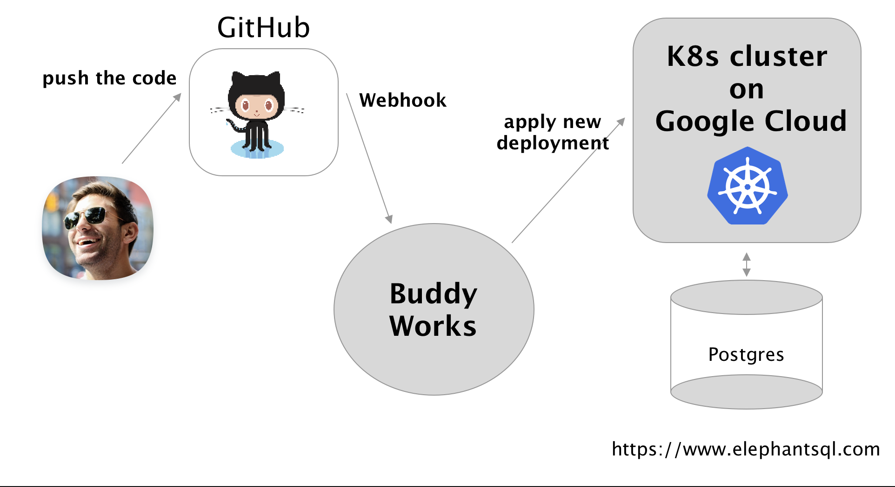

## Description

Task for Revolut DevOps Role.

## Installation

```bash
$ npm install
```

## Running the app locally

### in Docker
```bash
$ docker-compose up

```
will create 2 separate containers: one 
with DB and one with the application.

### local development
copy ```ormconfig_local.json``` to ```ormconfig.json```
There is a problem with NestJS envs, that's why 
it works like this.

## Test

I created only one basic test.

```bash
# unit tests
$ npm run test

```
## Deployment to K8s
to deploy the application, simply push code to ```k8s``` branch.
Buddy Works will automatically start the build and deploy the 
new pod.

##Pipeline
1. User push the code to repository
2. Github send Webhook to BuddyWorks
3. Buddy is building the docker container
 and push it to Google Repository
4. The last step of Buddy is to deploy
 new image/deployment on K8s cluster 
5. K8s is rolling update new application with zero downtime\



